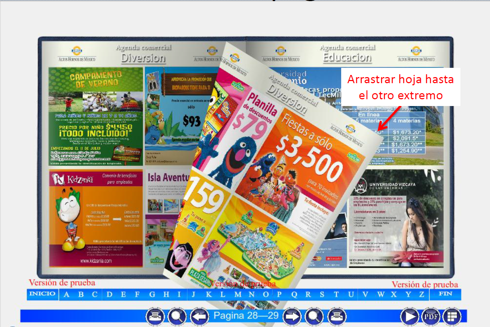

# 📦 Corporate Benefits Hub

## Overview
**Agenda Comercial** is an internal website designed exclusively for company employees. It serves as a portal where employees can access exclusive promotions, discounts, and benefits offered by various businesses within the company network. The website is hosted on the company's intranet, ensuring secure and seamless access.

### Home page

### Book version

## Idea & Concept
The concept behind Agenda Comercial was to create a centralized platform that:
- Allows employees to browse different categories of businesses offering exclusive promotions.
- Provides detailed pages for each business showcasing the available promotions.
- Features an engaging homepage with a slider displaying designs and promotions from these businesses.

An innovative component of the project is the **Dynamic Book Agenda**. This feature uses Adobe Flash to simulate a realistic book experience, complete with page-flipping effects, presenting promotional flyers in a visually appealing format.

## Features & Functionality
- **Main Menu:** Lists all business categories for quick and easy navigation.
- **Business Listings:** Each category displays a list of businesses along with their promotions.
- **Homepage Slider:** A dynamic slider that showcases designs and promotions from various businesses.
- **Dynamic Book Agenda:** An interactive, realistic book-like experience that displays promotional flyers with page-flipping effects.
- **Customization:** Small, user-focused customizations were implemented to enhance the overall experience.

## ⚙️ Tech Stack
| Category                | Tools & Frameworks |
|-------------------------|--------------------|
| **Frontend**            |  |
| **Platform / Hosting** |  |
| **Design & UI Tools** |  |
| **Other** |  |

### Architecture & Design
- The website follows a modular design approach to ensure maintainability and scalability.
- The homepage is designed to capture attention with a rotating slider that displays promotional content.
- The dynamic book agenda adds an interactive element that enhances user engagement by mimicking the experience of flipping through a real book.

## Installation & Setup
Since Agenda Comercial is hosted on the company’s internal servers, the setup is specific to our intranet environment:
- **Deployment Environment:** Windows Servers
- **Prerequisites:** 
  - A web server capable of hosting HTML, CSS, and JavaScript content.
  - Adobe Flash support for the dynamic book agenda feature.
- **Access:** Available through the company intranet.

> **Note:** Detailed installation and configuration steps are managed internally to fit our company’s IT infrastructure.

## Usage
Employees can interact with Agenda Comercial as follows:
1. **Homepage:** Access the main menu to explore different business categories.
2. **Business Pages:** Click on any category to view detailed information and current promotions from various businesses.
3. **Slider Interaction:** Enjoy the dynamic slider on the homepage that cycles through featured business promotions.
4. **Dynamic Book Agenda:** Engage with the interactive book agenda to view promotional flyers in a realistic page-turning format.

## Development Process & Challenges
### My Role
- **Page Development:** Assisted in creating and developing individual business pages.
- **Design:** Crafted thumbnails for each business and designed promotional flyers using Adobe Photoshop.
- **Customization:** Implemented various customizations as needed across the website.
- **Dynamic Book Agenda:** Contributed to the creation of an interactive book agenda using Adobe Flash.

### Challenges & Learnings
- **Technical Skills:** Enhanced my proficiency in web development, hosting management on Windows Servers, and graphic design with Photoshop.
- **Integration:** Learned to integrate design elements seamlessly with functional web features.
- **Business Communication:** Gained experience in communicating with business stakeholders to negotiate promotional deals.
- **Mentorship:** Benefited greatly from working alongside a senior software engineer during my first internship, which provided me with valuable industry insights and skills.

## Future Enhancements
- **Modernization:** Consider updating the dynamic book agenda by replacing Adobe Flash with modern, cross-platform web technologies.
- **Responsive Design:** Improve mobile responsiveness and overall accessibility.
- **Feature Expansion:** Introduce additional features based on employee feedback and emerging business requirements.

## Contributing
As an internal project, further enhancements and modifications are managed by our development team. For any suggestions or feedback, please reach out to the project lead.

## License
This project is for internal use within the company and is not intended for external distribution.

## Additional Resources
- **Documentation:** Further technical documentation is available on the company’s internal portal.
- **Related Projects:** Explore other internal initiatives that integrate web development and design innovations.
